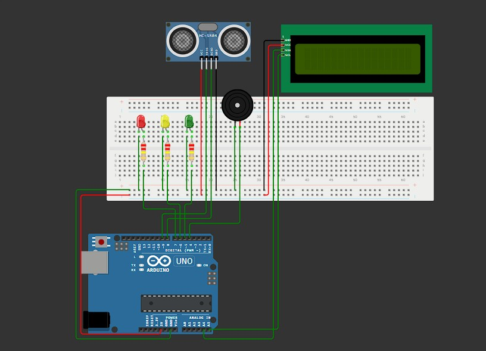

### Muito Antes Da Tempestade, Vem NOÉ!

# [noe.com.br](https://gs-fiap-noe.github.io/Gs-FrontEnd-WebDev/)

### ♦ Imagem Gabarito

</img>

## 📌 Descrição do Projeto

NOÉ é um sistema embarcado baseado em Arduino desenvolvido para monitorar, em tempo real, a **distância entre a superfície da água e a borda de um canal, rio ou reservatório**, com o objetivo de identificar **situações críticas que possam levar a enchentes**.

Utilizando um sensor ultrassônico, LEDs, buzzer e display LCD, o sistema classifica o estado da água em três níveis: **Normal**, **Alerta** e **Crítico**, emitindo avisos visuais e sonoros quando necessário.

---

## 🎯 Objetivo

Desenvolver uma solução acessível, eficaz e de fácil replicação que ajude **comunidades vulneráveis a se antecipar a enchentes**, emitindo alertas preventivos baseados na aproximação da água a um ponto crítico.

---

## ✅ Funcionalidades Implementadas

- 📏 Medição da distância da água até a borda em tempo real com sensor ultrassônico.
- 📺 Exibição da distância e do estado no display LCD 16x2.
- 🚥 LED Verde: situação normal (distância segura).
- 🟡 LED Amarelo: estado de alerta (distância intermediária).
- 🔴 LED Vermelho + 🔊 Buzzer: estado crítico (água muito próxima da borda).
- 🔁 Atualização automática a cada 2 segundos.

---

## 🔩 Componentes Utilizados

| Componente                  | Quantidade |
|----------------------------|------------|
| Arduino UNO                | 1          |
| Sensor Ultrassônico HC-SR04| 1          |
| LCD 16x2 com módulo I2C    | 1          |
| LED Verde                  | 1          |
| LED Amarelo                | 1          |
| LED Vermelho               | 1          |
| Buzzer                     | 1          |
| Resistores 220Ω            | 3          |
| Protoboard e Jumpers       | vários     |

---

## 🛠️ Como Reproduzir o Projeto

1. **Monte o circuito** seguindo o esquema abaixo:
   - HC-SR04: `TRIG -> D9`, `ECHO -> D8`
   - LEDs: `Verde -> D5`, `Amarelo -> D6`, `Vermelho -> D7`
   - Buzzer: `D4`
   - LCD I2C: `SDA -> A4`, `SCL -> A5`, `VCC -> 5V`, `GND -> GND`

2. **Altere a altura do objeto detectado pelo sensor** para simular o nível da água.

---

## ⚠️ Classificação por Distância

| Distância (m) | Estado   | Ações do Sistema            |
|---------------|----------|-----------------------------|
| > 3.0 m       | Normal   | LED Verde                   |
| 1.0 – 3.0 m   | Alerta   | LED Amarelo                 |
| ≤ 1.0 m       | Crítico  | LED Vermelho + Buzzer ativo |

---

## 🧠 Desafios e Soluções

- **Desafio**: Definir critérios claros de alerta com base em distância (em vez de nível).
  - ✔️ *Solução*: Inverter o cálculo tradicional e focar na "distância da borda" para melhor aplicabilidade em comportas ou muros de contenção.

- **Desafio**: Visualização simples para usuários leigos.
  - ✔️ *Solução*: Uso de LCD com linguagem direta (Distância + Estado) e LEDs coloridos.

- **Desafio**: Simular em ambientes virtuais como Wokwi.
  - ✔️ *Solução*: Código compatível com Wokwi e simulação 100% funcional sem componentes físicos.
 
##links

[Projeto Wokwi](https://wokwi.com/projects/new/arduino-uno)  
[Video Pitch](https://youtu.be/6oVhjPzkZYw)

## 👨‍💻 Desenvolvedores

Leonardo Da Silva Pinto 564929  
Samuel Enzo D. Monteiro 564391  
Lucas Toledo Cortonezi 563271  

   O Código-fonte deste projeto está na pasta `/src` deste repositório. Está devidamente comentado para facilitar a compreensão da lógica e da integração com os sensores.

